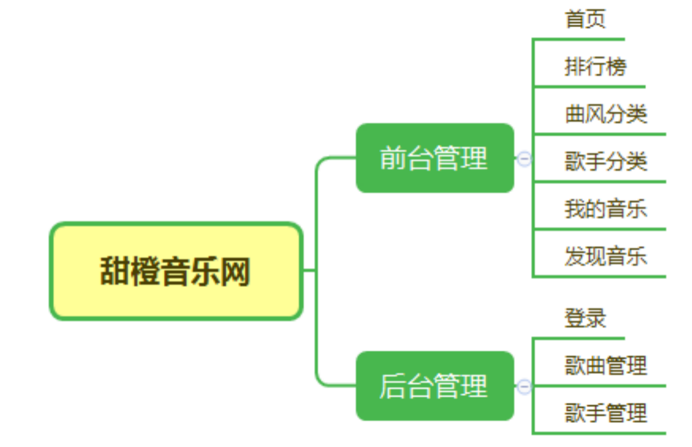
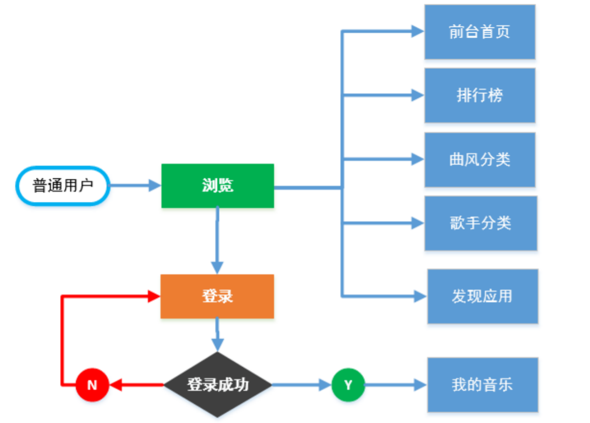
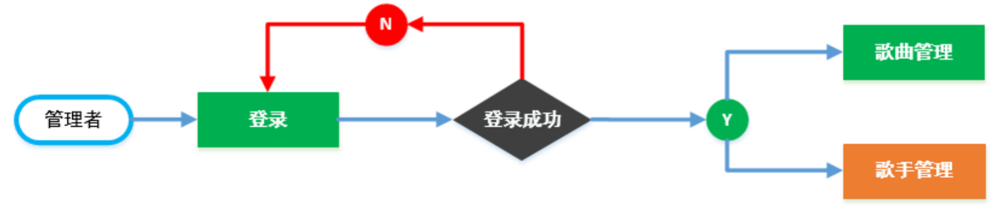
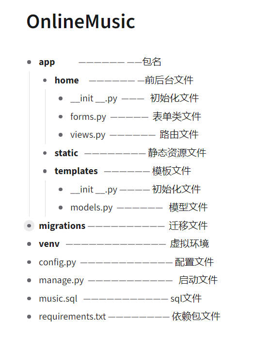
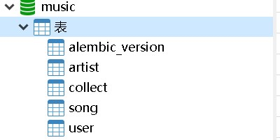
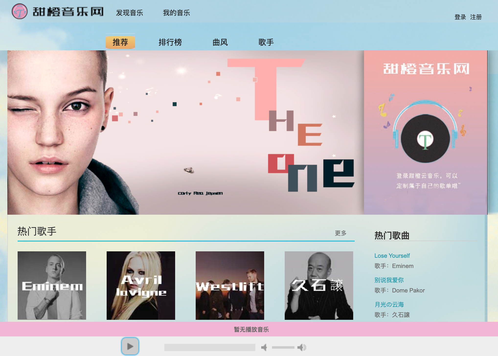

<h1>基于flask的音乐系统设计</h1>

以在线甜橙音乐网为例

<h2>一、需求分析</h2>

  1、具备用户管理功能，包括但不限于用户注册、登录、退出

  2、具备分类功能，根据不同地区、曲风、歌手类型对歌曲分类

  3、具备在线听音乐功能，用户点击选中音乐即可播放

  4、具备排行榜功能，根据用户点击歌曲播放次数进行排名

  5、具备搜索功能，用户根据歌曲名称或歌手名搜索歌曲

  6、具备收藏功能，用户登录之后便可收藏歌曲，可在“我的音乐”中查看

<h2>二、开发工具准备</h2>

  
操作系统：Windows 7及以上

 
  虚拟环境：virtualenv 

  数据库：PyMySQL驱动+ MySQL 
  
  开发工具：PyCharm 等 

  开发框架： Flask + SQLAlchemy + Flask-Script+ Flask-Migrate+ jQuery+ blueprint等

<h2>二、项目说明</h2>
  1、系统功能结构

  

  2、系统业务流程

  

  

<h2>三、项目配置</h2>

  1. 创建项目Online Music

	  文件夹结构
  	
   

  2. 配置虚拟环境
	
	  安装virtualenv
	
	  创建虚拟环境：virtualenv  venv 

	  激活虚拟环境 ：venv\Scripts\activate

  3. 安装项目所需的库

  4. 创建各类型文件，并编写源码

  5. 创建music数据库，并根据自己的数据库账号密码配置数据库和数据库名

  6. 在Terminal中使用migrate创建数据表
	  
python manage.py db init  # 创建迁移数据库，首次使用

	  
python manage.py db migrate # 创建迁移脚本
 
	  
python manage.py db upgrade # 把迁移应用到数据库中

  7. 将music.sql导入数据库中并刷新
	  
   

  8. 运行manage.py 
	
     python manage.py runserver
  
  9. 然后访问http://127.0.0.1:5000/端口

<h2>四、系统效果图</h2>
	

